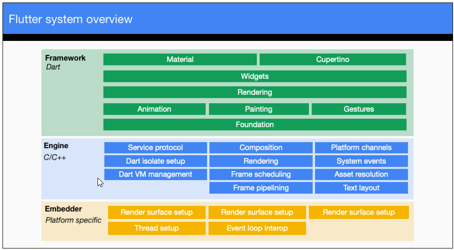

# Overview

my Flutter Projects

# Architecture

- Architectur Image
  - 
- Basis
  - 다른 프로그램들은 OS와 대화하지만 Flutter application은 OS와 얘기하지 않는다.
  - Flutter application doesn't use flatform's native widget
  - Engine is painting(rendering) everything.
    - ex. rendering button, inputs.
    - OS doesn't paint any widgets and run only engine.
    - The engine run framework and painting UI.
- How to run my code
  - The engine's C and C++ code are compiled with LLVM.
  - iOS
    - Dart code(both the SDK's and my codes) are compiled as navie ARM library.
    - The libary is included in a "runner" iOS project, the runner run the engine.
    - The engine render UI.
  - Android
    - C and C++ code (engine) are compiled with Android's NDK.
    - Dart code are compiled as ARM and x86 libraries.
    - The libraries are included in a "runner" Android project, the runner run the engine.
    - The engine render UI.
- Embedder
  - Pointing "runner" project.
  - 다양한 OS용 empbedder가 있다.

# installation

- Install flutter by chocolately
  - https://chocolatey.org/install
  - run choco powershell by administrator
    - PS>Get-ExecutionPolicy
    - PS>Set-ExecutionPolicy AllSigned
    - PS>Set-ExecutionPolicy Bypass -Scope Process -Force; [System.Net.ServicePointManager]::SecurityProtocol = [System.Net.ServicePointManager]::SecurityProtocol -bor 3072; iex ((New-Object System.Net.WebClient).DownloadString('https://community.chocolatey.org/install.ps1'))
    - PS>choco install flutter
- Install Android SDK -https://docs.flutter.dev/get-started/install/windows#android-setup
- VS code extensions
  - dart extension
  - flutter extension

# flutter cli

## flutter upgrade
- flutter channel master
- flutter upgrade

## get dependencies
- flutter pub get

## create project

- flutter create project_name

## run project

- F5 (Debug)
- PS> flutter run

